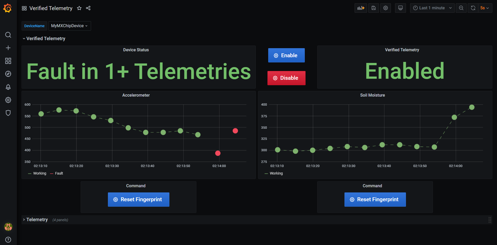

#Instructions to get Solution Template Running with Verified Telemetry Sample
## Setup Docker Desktop
## Edit [constants](./constants.js) file to set user defined values
|Constant name|Value|
|-------------|-----|
|`connectionString` |{*Your IoT Hub Connection String*}|
|`deviceId` |{*Your device ID*}|

## Run the following commands

```shell
docker-compose up -d
```

## Open your browser and navigate to below URL
> http://localhost:3030


|Credential|Default Value|
|-------------|-----|
|`username` |admin|
|`password` |admin|

##View the Dashboard
-  Search for "Verified Telemetry" Dashboard

-  Select your device

