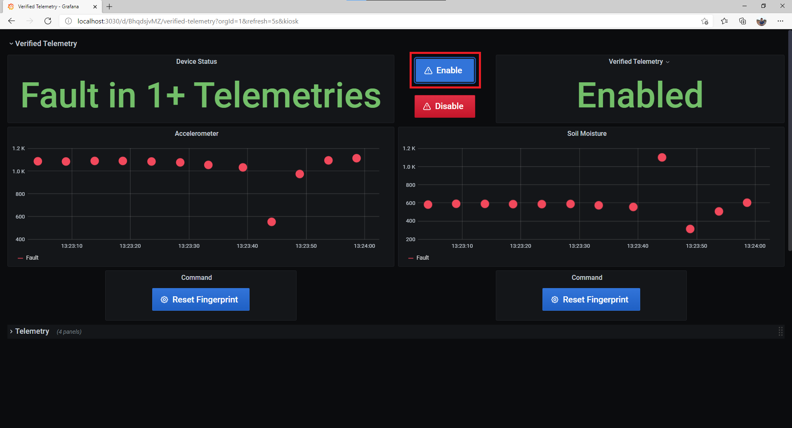
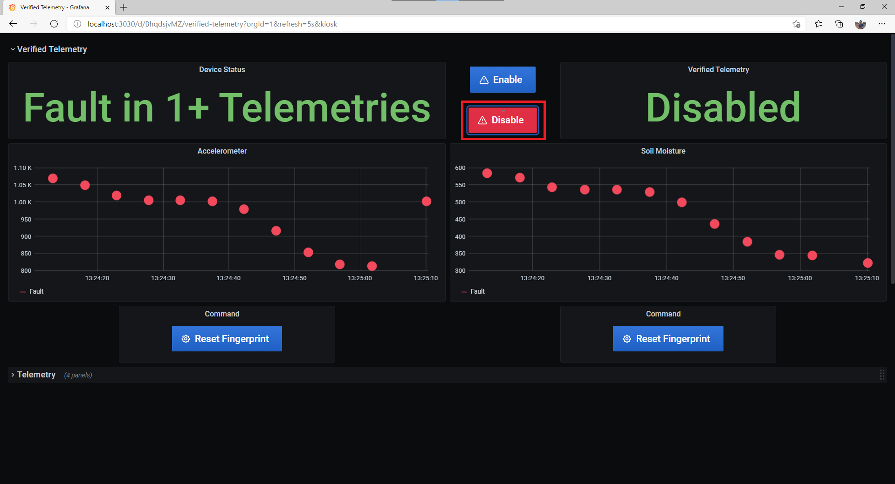
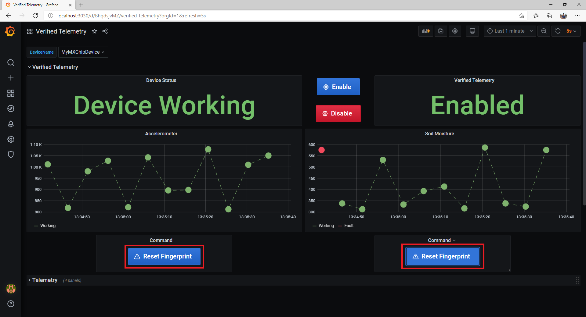

# Verified Telemetry Solution Sample
- This guide showcases how the Verified Telemetry features can be utilised in real world scenarios.

# Steps to setup Solution Template
## Step 1: Run through one of the [device samples](https://github.com/Azure/Verified-Telemetry-Device-Sample) for [Verified Telemetry Library](https://github.com/Azure/Verified-Telemetry)
## Step 2: Ensure your device is up and running
## Step 3: [Setup Docker Desktop](https://docs.docker.com/desktop/)
## Step 4: Edit [constants](./constants.js) file to set user defined values
|Constant name|Value|
|-------------|-----|
|`connectionString` |{*Your IoT Hub Connection String*}|
|`deviceId` |{*Your device ID*}|
  > NOTE: Make sure that you provide the IoT Hub connection string and not the device connection string
## Step 5: Run the following commands

```shell
docker-compose up -d
```

## Step 6: Open your browser and navigate to below URL
> http://localhost:3030


## Step 7: Enter following credentials
|Credential|Default Value|
|-------------|-----|
|`username` |admin|
|`password` |admin|

## Step 8: View the Dashboard
-  Search for "Verified Telemetry" Dashboard

-  Select your device


# Interacting with the Dashboard
## Enable/Disable Verified Telemetry
### Enable

### Disable

## Reset Fingerprint Template

