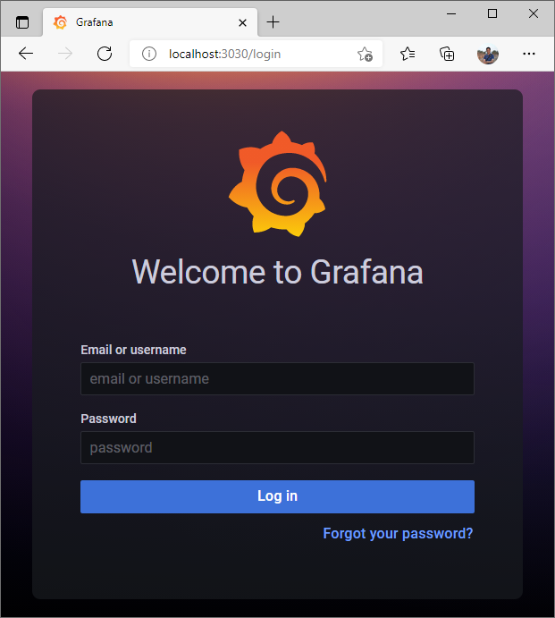
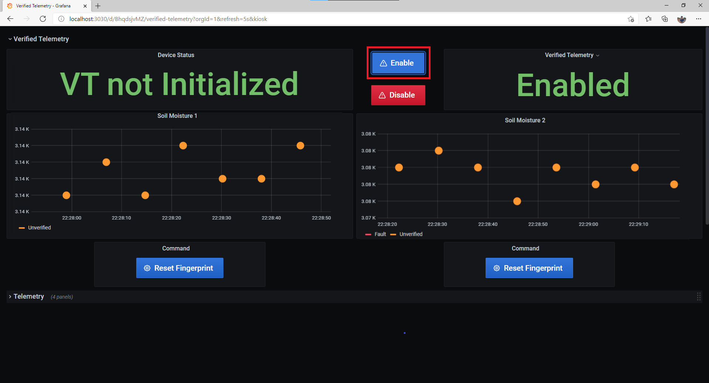
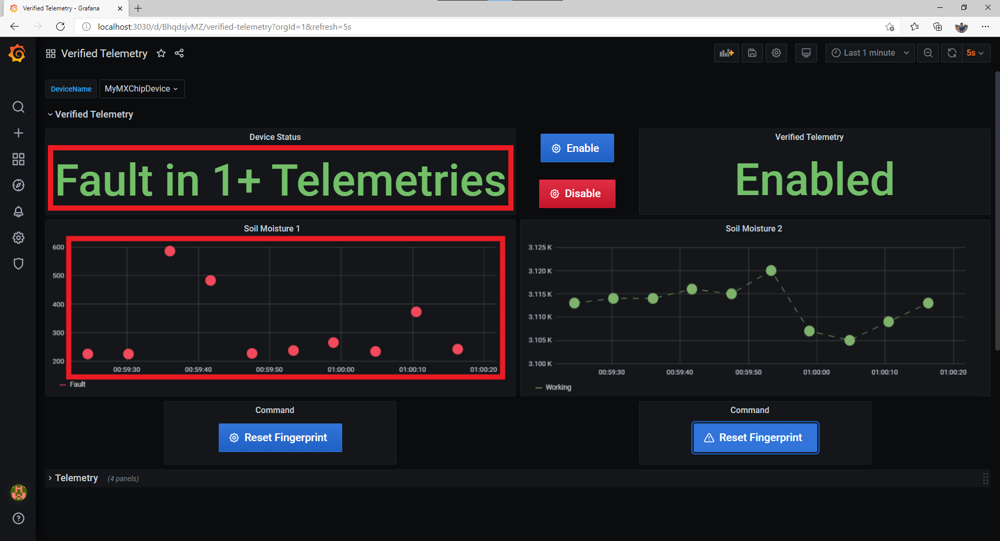

# Verified Telemetry Custom Solution Sample
## Table of Contents
* [Verified Telemetry Overview](https://github.com/Azure/Verified-Telemetry-Solution-Sample#verified-telemetry-overview)
* [Steps to setup Custom Solution Template](https://github.com/Azure/Verified-Telemetry-Solution-Sample#steps-to-setup-custom-solution-template)
* [Steps to setup Verified Telemetry Configuration](https://github.com/Azure/Verified-Telemetry-Solution-Sample#steps-to-setup-verified-telemetry-configuration)
* [Consuming Verified Telemetry Information](https://github.com/Azure/Verified-Telemetry-Solution-Sample#consuming-verified-telemetry-information)

## Verified Telemetry Overview
The quality of sensor data is fundamental for driving IoT adoption. Since IoT sensors are made of low-cost components, deployed in-the-wild and in harsh environments, they are prone to failures leading to faulty or dirty data. The effect of bad data will lead to the well-known garbage-in garbage-out process, leading to cascading ill-effects upstream and at times catastrophic decisions.

Verified Telemetry (VT) is a state-of-the-art solution to determine the health of the sensor, i.e., working or faulty, which is consequently used to determine the quality of the sensed data. This is achieved by devising an intelligent “sensor fingerprint”, a set of unique electrical characteristics that differs between working and faulty sensors. The fingerprints can detect faults for a wide variety of off-the-shelf sensors and can be easily implemented with lightweight software code running on the IoT device. This novel approach empowers customers with a reliable and automated way to remotely measure and observe the health of the sensor in real-time alongside the data collected. The data associated with a validated fingerprint results in verified telemetry (as shown below).


| |Description |
|-|-|
|[Verified Telemetry Device SDK](https://github.com/Azure/Verified-Telemetry) |The SDK which builds on the Azure RTOS middleware |
|[Verified Telemetry Device Sample](https://github.com/Azure/Verified-Telemetry-Device-Sample) |These Getting Started guides shows device developers how to combine Verified Telemetry with [Azure IoT](https://azure.microsoft.com/overview/iot/) and [Azure RTOS](https://docs.microsoft.com/azure/rtos/). |
|[Verified Telemetry Custom Solution Sample](https://github.com/Azure/Verified-Telemetry-Solution-Sample) | Uses InfluxDB, Grafana and the [Azure IoT Node.js SDK](https://github.com/Azure/azure-iot-sdk-node) to communicate with [Azure IoT Hub](https://docs.microsoft.com/azure/iot-hub/) and showcase how the Verified Telemetry features can be utilized in real world scenarios.|

## Steps to setup Custom Solution Template
### Prerequisites
* Setup one of the board specific device samples: 
    * MXCHIP: 
      * [AZ3166](MXChip/AZ3166)
    * STMicroelectronics:
      * [B-L475E-IOT01A](STMicroelectronics/STM32L4_L4+)
      * [B-L4S5I-IOT01A](STMicroelectronics/STM32L4_L4+)
  > NOTE:  Ensure your device is up and running before you proceed to the next step
 
  > NOTE: Save the Device ID that you have configured

### Step 1: Setup Docker Desktop
* Steps to install can be found [here](https://docs.docker.com/desktop/)
### Step 2: Get IoT Hub Connection String
* In your CLI console, run the [az iot hub show-connection-string](https://docs.microsoft.com/en-us/cli/azure/iot/hub?view=azure-cli-latest#az-iot-hub-show-connection-string) command to get the connection string for your IoT hub.

    ```shell
    az iot hub show-connection-string --name {YourIoTHubName}
    ```
### Step 3: Modify configuration file for Azure IoT settings
* Open [configuration](./constants.js) file 
* Set the Azure IoT device information constants
  |Constant name|Value|
  |-------------|-----|
  |`connectionString` |{*Your IoT Hub Connection String*}|
  |`deviceId` |{*Your device ID*}|
  > NOTE: Make sure that you provide the IoT Hub connection string and not the device connection string
### Step 4: Run the Docker application

```shell
docker-compose up -d
```
  > NOTE: This step needs to be implemented everytime the configuration file is updated 
### Step 5: Open your browser and navigate to below URL
> http://localhost:3030


### Step 6: Enter following credentials
|Credential|Default Value|
|-------------|-----|
|`username` |admin|
|`password` |admin|

### Step 7: View the Dashboard
-  Search for "Verified Telemetry" Dashboard

-  Select your device


## Steps to setup Verified Telemetry Configuration
### Enable Verified Telemetry
* Ensure Verified Telemetry is enabled

    

### Collect Fingerprint Template for Accelerometer telemetry 
* Issue command `Set/Reset Fingerprint Template` for setting up Verified Telemetry for the 'Accelerometer'telemetry

    

### Collect Fingerprint Template for Soil Moisture telemetry 
* Issue command `Set/Reset Fingerprint Template` for setting up Verified Telemetry for the 'Soil Moisture' telemetry

    

## Consuming Verified Telemetry Information  
* The property `Device Status` indicates that all the telemetries supported by Verified Telemetry are verified and the telemetry color GREEN indicates that both Accelerometer and Soil Moisture telemetries are verified. 

    

* In case of fault with the Soil Moisture sensor, the color of Soil Moisture telemetry changes to RED, indicating that the Soil Moisture telemetry has a FAULT and should not be consumed by upstream processes. The 'Device Status' also changes to "Fault in 1+ Telemetries "
   
    

