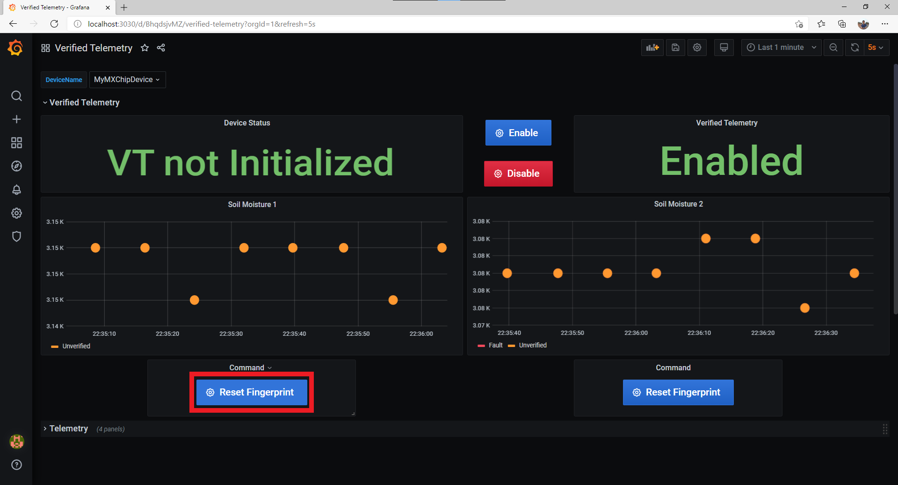
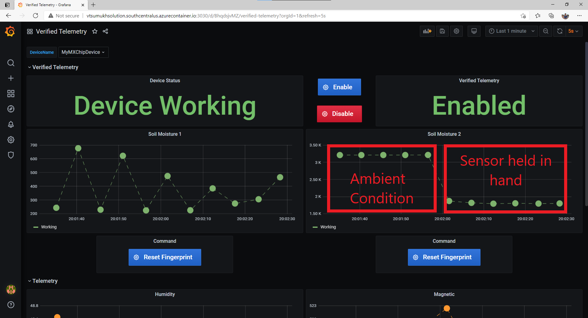
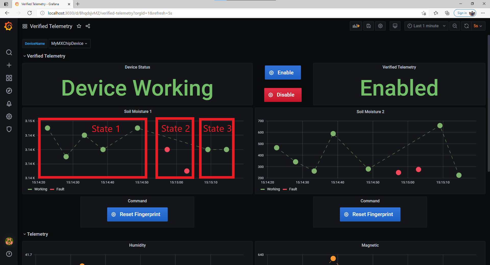
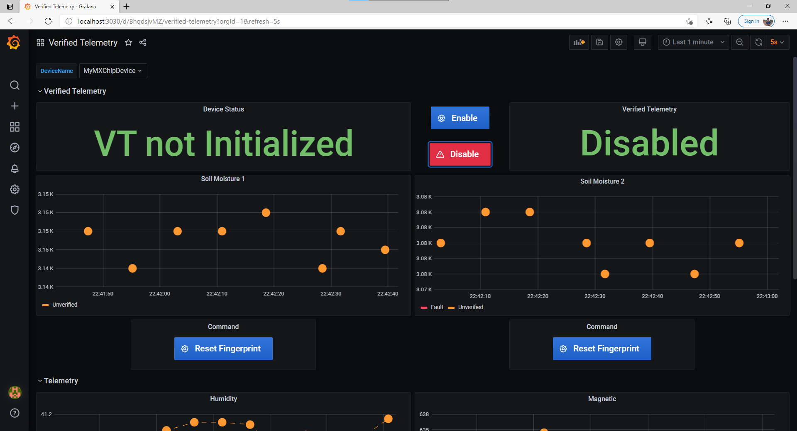
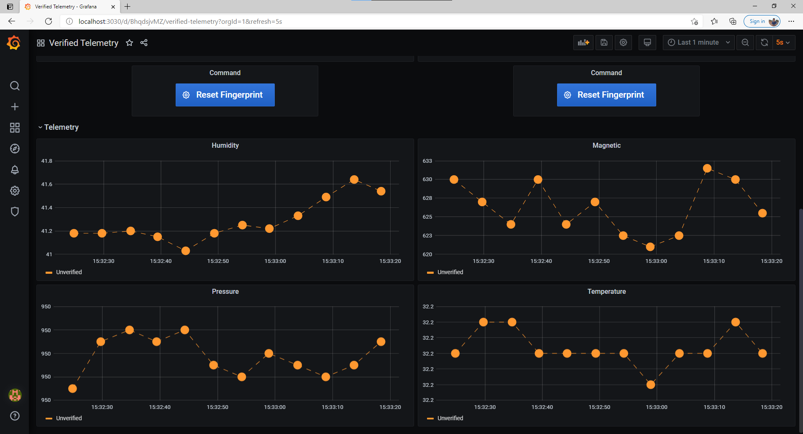

# Verified Telemetry Custom Solution Sample
## Table of Contents
* [Verified Telemetry Overview](https://github.com/Azure/Verified-Telemetry-Solution-Sample#verified-telemetry-overview)
* [Steps to setup Custom Solution Template](https://github.com/Azure/Verified-Telemetry-Solution-Sample#steps-to-setup-custom-solution-template)
* [Steps to setup Verified Telemetry Configuration](https://github.com/Azure/Verified-Telemetry-Solution-Sample#steps-to-setup-verified-telemetry-configuration)
* [Consuming Verified Telemetry Information](https://github.com/Azure/Verified-Telemetry-Solution-Sample#consuming-verified-telemetry-information)
* [FAQ](https://github.com/Azure/Verified-Telemetry-Solution-Sample#faq)
* [Next Steps](https://github.com/Azure/Verified-Telemetry-Solution-Sample#next-steps)
## Verified Telemetry Overview
The quality of sensor data is fundamental for driving IoT adoption. Since IoT sensors are made of low-cost components, deployed in-the-wild and in harsh environments, they are prone to failures leading to faulty or dirty data. The effect of bad data will lead to the well-known garbage-in garbage-out process, leading to cascading ill-effects upstream and at times catastrophic decisions.

Verified Telemetry (VT) is a state-of-the-art solution to determine the health of the sensor, i.e., working or faulty, which is consequently used to determine the quality of the sensed data. This is achieved by devising an intelligent “sensor fingerprint”, a set of unique electrical characteristics that differs between working and faulty sensors. The fingerprints can detect faults for a wide variety of off-the-shelf sensors and can be easily implemented with lightweight software code running on the IoT device. This novel approach empowers customers with a reliable and automated way to remotely measure and observe the health of the sensor in real-time alongside the data collected. The data associated with a validated fingerprint results in verified telemetry (as shown below).


| |Description |
|-|-|
|[Verified Telemetry Device SDK](https://github.com/Azure/Verified-Telemetry) |The SDK which builds on the Azure RTOS middleware |
|[Verified Telemetry Device Sample](https://github.com/Azure/Verified-Telemetry-Device-Sample) |These Getting Started guides shows device developers how to combine Verified Telemetry with [Azure IoT](https://azure.microsoft.com/overview/iot/) and [Azure RTOS](https://docs.microsoft.com/azure/rtos/). |
|[Verified Telemetry Custom Solution Sample](https://github.com/Azure/Verified-Telemetry-Solution-Sample) | Uses InfluxDB, Grafana and the [Azure IoT Node.js SDK](https://github.com/Azure/azure-iot-sdk-node) to communicate with [Azure IoT Hub](https://docs.microsoft.com/azure/iot-hub/) and showcase how the Verified Telemetry features can be utilized in real world scenarios.|

## Steps to setup Custom Solution Template
This getting started guide will help you setup VT solution sample, which allows users to collect fingerprints on-the-fly, view telemetry data and telemetry status in a dashboard. The solution sample is developed as a docker container image, thus enabling users to seamlessly interact with VT enabled device. 

### Note on methods to setup Solution Sample
You can setup the solution sample in of the two ways mentioned below:
  * Using Docker Desktop: If you already have installed docker or know how docker works, we suggest to run the solution sample using docker desktop. Please jump to [Step 1](https://github.com/Azure/Verified-Telemetry-Solution-Sample#step-1-clone-the-repository).

  * Using Azure DevOps Pipelines: If you do not wish to install docker desktop, we suggest you to follow our [guide](https://github.com/Azure/Verified-Telemetry-Solution-Sample/blob/main/docs/AzurePipeline.md) on setting up the Solution Sample Using Azure Container Registry and Azure DevOps Pipelines. 
    >Note: After completing the setup using Azure Containers and Azure DevOps, you can continue referring to this guide from [Step 6](https://github.com/Azure/Verified-Telemetry-Solution-Sample#step-6-enter-following-credentials)

### Prerequisites
* Setup one of the board specific device samples: 
    * MXCHIP: 
      * [AZ3166](MXChip/AZ3166)
    * STMicroelectronics:
      * [B-L475E-IOT01A](STMicroelectronics/STM32L4_L4+)
      * [B-L4S5I-IOT01A](STMicroelectronics/STM32L4_L4+)
  > NOTE:  Ensure your device is up and running before you proceed to the next step
 
  > NOTE: Save the Device ID that you have configured
  
  > WARNING: Ensure the IoT Hub that you are using has ZERO endpoints configured (TSI/Blob Storage etc). This solution sample requires all IoT Hub Data to be routed to the built-in Event Hub and hence if any endpoint is configured, the solution sample would not work!

### Step 1: Clone the repository
To clone the repo, run the following command:

```shell
git clone --recursive https://github.com/Azure/Verified-Telemetry-Solution-Sample.git
```
### Step 2: Setup Docker Desktop
* Steps to install Docker locally can be found [here](https://docs.docker.com/desktop/)
* If you run into issues, please see [Docker Troubleshooting page](https://docs.docker.com/docker-for-windows/troubleshoot/) for more details
* Ensure Docker Desktop is up and running (click the system tray icon on the task bar to see the docker status)

### Step 3: Get IoT Hub Connection String
* In your CLI console, run the [az iot hub show-connection-string](https://docs.microsoft.com/en-us/cli/azure/iot/hub?view=azure-cli-latest#az-iot-hub-show-connection-string) command to get the connection string for your IoT hub.

    ```shell
    az iot hub show-connection-string --name {YourIoTHubName}
    ```
### Step 4: Modify configuration file for Azure IoT settings
This is a very important step to ensure the docker image knows which IoT device to connect to. Please provide the following details: 

* Open the following file in a text editor:

    > *Verified-Telemetry-Solution-Sample\constants.js*
* Set the Azure IoT device information constants
  |Constant name|Value|Example|
  |-------------|-------|------|
  |`connectionString` |{*Your IoT Hub Connection String*}| e.g., 'HostName=xxxxxxx.azure-devices.net; SharedAccessKeyName=iothubowner; SharedAccessKey=xxxxxxxxxxx'| 
  |`deviceId` |{*Your device ID*}| e.g., MyMXChipDevice|

  > NOTE: Make sure that you provide the IoT Hub connection string and not the device connection string
### Step 4: Run the Docker application
  * Install [VS Code](https://code.visualstudio.com/download)
  * Open the Extensions view (Ctrl+Shift+X), search for docker to filter results and select Docker extension authored by Microsoft.

    
  * Open the folder (Ctrl+K+O) *Verified-Telemetry-Solution-Sample* in VS Code
  * Open Explorer View (Ctrl+Shift+E), Right click on file docker-compose.yml and select *Compose Up*
    
    
  * Ensure notifications on your PC are ON, and accept the file sharing request which you will get while docker creates your application

    
  * In case you update your constants.js file later, Right click on file docker-compose.yml and select *Compose Restart* 

NOTE: If you do not want to use VS code and the docker extension, you can run the following command in the root folder  *Verified-Telemetry-Solution-Sample*

  ```shell
  docker-compose up -d
  ```
### Step 5: Open your browser and navigate to below URL
> http://localhost:3030


### Step 6: Enter following credentials
|Credential|Default Value|
|-------------|-----|
|`username` |admin|
|`password` |admin|

You can skip the password reset and proceed forward.

### Step 7: View the Dashboard
-  Navigate to Search -> Verified Telemetry Dashboard
  

-  Select your deviceName from the drop down.


## Steps to setup Verified Telemetry Configuration
### Enable Verified Telemetry
* By default, Verified Telemetry is enabled and the status is shown on the right-hand side of the dashboard as seen in the image below.
* If the status is disabled, Please click the `Enable` button to turn ON Verified Telemetry. 

    


### Collect Fingerprint Template for Soil Moisture 1 telemetry 
* In order to get VT status for Soil Moisture 1 telemetry, we should collect a fingerprint template (ideally once).
* To collect the fingerprint template for the attached sensor 'Soil Moisture 1' telemetry, issue command `Set/Reset Fingerprint Template`

  > Note: If the fingerprint template is not set for a device, VT status cannot be obtained and will result in telemetry data shown in *red*

    


### Collect Fingerprint Template for Soil Moisture 2 telemetry 
* In order to get VT status for Soil Moisture 2 telemetry, we should collect a fingerprint template (ideally once).
* To collect the fingerprint template for the attached sensor 'Soil Moisture 2' telemetry, issue command `Set/Reset Fingerprint Template`

  > Note: If the fingerprint template is not set for a sensor, VT status cannot be obtained and will result in telemetry data shown in *RED*

    

## Consuming Verified Telemetry Information  
* Now that for both the sensors working fingerprint template is collected, we can now see both the device status and telemetry status. 
* The property `Device Status` indicates that all the telemetries supported by Verified Telemetry (i.e., Soil Moisture 1 and 2) are verified and the telemetry color *GREEN* indicates that both Soil Moisture 1 and Soil Moisture 2 telemetries are verified. 

    

* To test whether the attached sensors are working as expected, hold the moisture sensor in your palm as shown below. Since these sensors are capacitive sensors, more the moisture lower is their output. We can see this expected decrease on the solution sample dashboard.

    
    

* `Simulate a faulty sensor:` To simulate a faulty sensor, just disconnect Ground Pin (GND) on the Soil Moisture Sensor 1 which would create an Open Port fault!

    * We can see that the telemetry data still shows some data, which is typically garbage/dirty. Detecting such data as garbage/faulty is non-trivial and VT automatically detects the faulty sensor and changes the telemetry color to *RED*
   
    

    * You can now connect back the Ground Pin to the sensor and see that telemetry color of 'Soil Moisture 1' sensor turning to *GREEN* immediately. 

## FAQ
* Q: What happens if the device reboots after collection of Fingerprint Template?
    * A: Our library stores the Verified Telemetry Fingerprint Templates in the Digital Twin. By fetching the Digital Twin after reboot, the device goes back to its original state that it was in before reboot. Thus, user collects the fingerprint template only once when the sensor is provisioned and working. 

    * The image below showcases the three states the device goes through:
      1. State 1: Before Reboot
      2. State 2: After Reboot, BEFORE Digital Twin sync (since no template is found, telemetry status is unknown and shown in RED) 
      2. State 3: After Reboot, AFTER Digital Twin sync (template is synced and telemetry status is verified and shown in GREEN)

      
* Q: What happens if Verified Telemetry is disabled by the property *enableVerifiedTelemetry* ?
    * A: The telemetry status of all telemetries supported by Verified Telemetry go to *false*, indicating that the telemetries are not Verified.
     
* Q: Does the solution sample display Telemetries which are not supported by Verified Telemetry feature?
    * A: Yes! You can scroll down to see the telemetries which are not supported by VT in the device samples. These telemetries can be identified by a lack of 'vT' + 'Telemetry Name' component in the Digital Twin.
      

## Next Steps
* With this sample, you have now setup a Verified Telemetry Custom Solution Sample and interacted with a Verified Telemetry Device Sample
