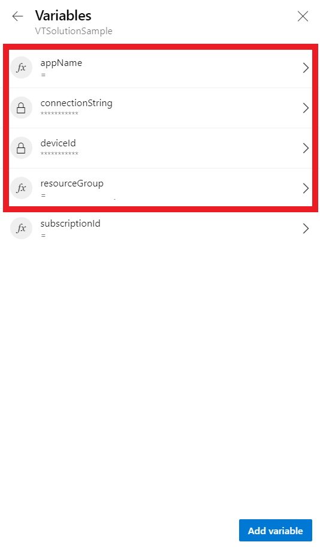
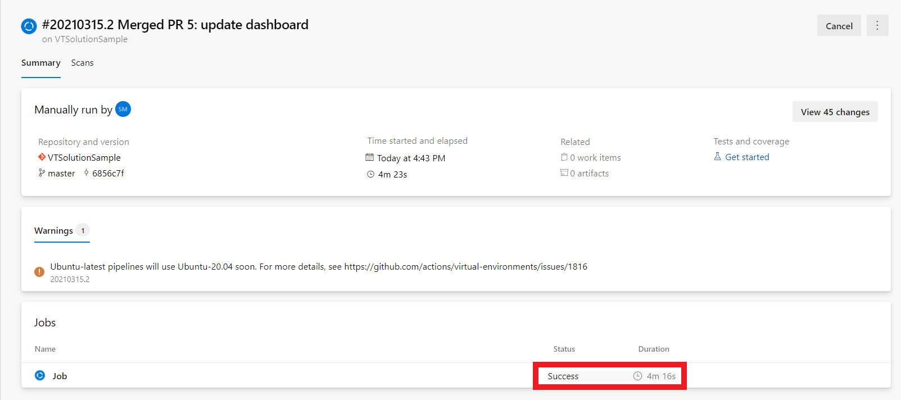

# Steps to setup custom solution sample using Azure DevOps and Azure Containers
* This guide will help you setup VT solution sample using Azure Pipelines and Azure Containers, instead of Docker Desktop
* If you still wish to use Docker Desktop, refer to the [Solution Sample Readme](https://github.com/Azure/Verified-Telemetry-Solution-Sample/blob/main/README.md)
## Prerequisites:
* Setup one of the board specific device samples: 
    * MXCHIP: 
      * [AZ3166](MXChip/AZ3166)
    * STMicroelectronics:
      * [B-L475E-IOT01A](STMicroelectronics/STM32L4_L4+)
      * [B-L4S5I-IOT01A](STMicroelectronics/STM32L4_L4+)
  > NOTE:  Ensure your device is up and running before you proceed to the next step
 
  > NOTE: Save the Device ID that you have configured

* In your local/Azure Portal CLI console, run the [az iot hub show-connection-string](https://docs.microsoft.com/en-us/cli/azure/iot/hub?view=azure-cli-latest#az-iot-hub-show-connection-string) command to get the connection string for your IoT hub.

    ```shell
    az iot hub show-connection-string --name {YourIoTHubName}
    ```
* Save this IoT Hub Connection String
 

## Step 1:
* Navigate to the Solution Sample DevOps Pipeline URL : https://dev.azure.com/DependableIoT/VTSolutionSample/_build

    > Note: If you do not have access, you can raise a request by contacting Dr. Akshay Nambi

## Step 2:
* Select Pipeline *VTSolutionSample*
    

## Step 3: 
* You will see a log of Pipeline runs
* To setup the Solution Sample for your device, click on *Run Pipeline*
    

## Step 4: 
* Now you have to configure the branch which would be picked up by the pipeline 
* Select the *master* branch

    

## Step 5:
* Now you have to configure the device specific variables for the Solution Sample
* Select *Variables* under *Advanced Options*

    

## Step 6:
* The highlighted variables are the variables you need to configure one by one

    

## Step 7:
* Select variable *appName*
* Update the value to *vt{YourName}solution*

    > Note: The reason for mentioning your name in *appName* is to maintain unique URLs (Refer to step 15)
* Click on *Update*

    

## Step 8:
* Select variable *connectionString*

* Enter the IoT Hub Connection String that you have saved previously

* Click on *Update*

    

## Step 9:
* Select variable *deviceId*

* Enter the Device ID that you have configured in the Device Sample

* Click on *Update*

    

## Step 10:
* Select variable *resourceGroup*

* Update the value to * NonProdIoT{YourName}*

    > Note: Please try to create a Resource Group in the specified format so that it is easier for us to delete resources after Bug Bash

    > Note: A separate and new Resource Group is required to maintain a custom solution for each user

* Click on *Update*

    

## Step 11:
* Now that all variables are configured, click on *Back icon*

    

    > Note: Ensure that you do not modify or remove the pre-configured subscriptionID variable

## Step 12:
* It is time to run the Pipeline with the configured variables
* Hit *Run* and the pipeline will start setting up your Custom Solution

    

## Step 13:
* After clicking on *Run* Azure Devops will open the monitoring page for the particular Run/Job
* The pipeline typically takes about 4-5 minutes (worst case around 8 minutes) to complete the setup of your Solution Sample
* You can see the status of the Job as *Running* and the time taken by the Job next to it

    

## Step 14:
* Wait till the Job is finished
* When the Job is completed successfully, the status of the Job will turn to *Success*
* Your Solution Sample is now setup!

    

## Step 15:
* To access the Solution Sample, navigate to http://vt{YourName}solution.southcentralus.azurecontainer.io:3030/

    > Note: The URL is dependent on the *appName* that you configured in Step 8 

    

## Next Steps:
* [Navigate to Step 6](https://github.com/Azure/Verified-Telemetry-Solution-Sample#step-6-enter-following-credentials) of the Solution Sample Readme for the Next Steps
* Please note that the Azure Resources created in this guide would be deleted by the Verified Telemetry Team after Bug Bash concludes
