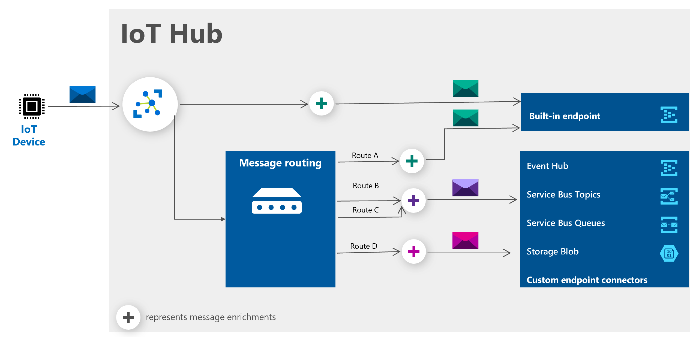

# Fetching Verified Telemetry Information for your Custom Solution
## Table of Contents
* [Data Paths](https://github.com/Azure/Verified-Telemetry-Solution-Sample/blob/main/docs/customSolution.md#data-paths)
* [Fetching Verified Telemetry Status](https://github.com/Azure/Verified-Telemetry-Solution-Sample/blob/main/docs/customSolution.md#fetching-verified-telemetry-status)
* [Query Digital Twin for Verified Telemetry](https://github.com/Azure/Verified-Telemetry-Solution-Sample/blob/main/docs/customSolution.md#query-digital-twin-for-verified-telemetry)
* [Message Enrichment for Verified Telemetry](https://github.com/Azure/Verified-Telemetry-Solution-Sample/blob/main/docs/customSolution.md#message-enrichment-for-verified-telemetry)
* [Steps to setup Message Enrichment for Verified Telemetry](https://github.com/Azure/Verified-Telemetry-Solution-Sample/blob/main/docs/customSolution.md#steps-to-setup-message-enrichment-for-verified-telemetry)
* [Consuming Telemetry messages with Message Enrichment for Verified Telemetry](https://github.com/Azure/Verified-Telemetry-Solution-Sample/blob/main/docs/customSolution.md#consuming-telemetry-messages-with-message-enrichment-for-verified-telemetry)

## Data Paths

### Hot Path
* The Hot Path is where data from the input stream(s) is processed in near real-time.
* This data path is useful for all systems that need to process data and take some kind of action in real-time.
### Cold Path
* The Cold Path is where data from the input stream(s) is stored and then processed at some later time.  
* This data path is the more traditional path where data is ingested, then at some later time the data is processed.

## Fetching Verified Telemetry Status
Verified Telemetry SDK provides a telemetry status for each supported telemetry.
There are two ways to utilize this status information in your existing custom solution
1. Query Digital Twin
2. Message Enrichment

## Query Digital Twin for Verified Telemetry
    > Note: This method only works for the Hot Path
* An ANDing operation needs to be perfomed where the telemetry message of a telemetry supported by Verified Telemetry is coupled with the telemetry status of that telemetry, which is present in the Digital Twin of the device.

* Here is an example of a JS function which fetches the Telemetry Status of the telemetry that is passed to it

    ```js
    let getVerifiedTelemetryStatus = function (telemetryName, dtServiceclient) {

        digitalTwinLocalCopy = await dtServiceclient.getDigitalTwin(constants.deviceId);
        var verifiedTelemetryComponentName = 'vT' + telemetryName; 

        if(digitalTwinLocalCopy.hasOwnProperty(verifiedTelemetryComponentName))
        {
            console.log("Verified Telemetry Status fetched from Digital Twin");
            return(digitalTwinLocalCopy[verifiedTelemetryComponentName].telemetryStatus);
        }
        else
        {
            return(false);
        }
    };
    ```
* The telemetry status information when coupled with the telemetry message forms Verified Telemetry
* Here is an example of how the JS function **getVerifiedTelemetryStatus**  can be used in an existing solution template
    ```js
    var { EventHubClient, EventPosition } = require('@azure/event-hubs');
    let iothubreader = require('./eventProcessor');
    let IoTHubTokenCredentials = require('iothub').IoTHubTokenCredentials;
    let DigitalTwinServiceClient = require('azure-iothub').IoTHubTokenCredentials;
    var constants = require('./constants');

    const credentials = new IoTHubTokenCredentials(constants.connectionString);
    const dtServiceclient = new DigitalTwinServiceClient(credentials);

    EventHubClient.createFromIotHubConnectionString(constants.connectionString).then(function (client) {
    console.log("Successully created the EventHub Client from iothub connection string.");
    ehClient = client;
    return ehClient.getPartitionIds();
    }).then(function (ids) {
        console.log("The partition ids are: ", ids);
        return ids.map(function (id) {
        return ehClient.receive(id, iothubreader.processMessage, iothubreader.printError, { eventPosition: EventPosition.fromEnqueuedTime(Date.now()) });
        });
    }).catch(iothubreader.printError);

    let processMessage = function (message) {
        let body = message.body;
        let deviceId = message.annotations["iothub-connection-device-id"];
        if(deviceId == constants.deviceId)
        {
            for (const key of Object.keys(body))
            {
                getVerifiedTelemetryStatus(key, dtServiceclient);
            }
        }
    
    };
    ```
## Message Enrichment for Verified Telemetry
    > Note: This method works for BOTH the Hot Path as well as the Cold Path
* Message enrichments simplifies post-processing of your data and can reduce costs of calling device twin APIs for information. 
* This capability allows you to stamp information on your messages, such as details from your device twin, your IoT Hub name or any static property you want to add.
    
* By adding message enrichment, the telemetry message itself can be appended with telemetry status as additional property, thus forming Verified Telemetry
    

## Steps to setup Message Enrichment for Verified Telemetry
1. On [Azure Portal](https://ms.portal.azure.com) go to your IoT hub by selecting **Resource groups**. Then select the resource group set up for during the Device Sample (**MyResourceGroup**). Find the IoT hub in the list, and select it. Select **Message routing** for the IoT hub.

   

   The message routing pane has three tabs labeled **Routes**, **Custom endpoints**, and **Enrich messages**. Use the third tab to add message enrichments. Let's enrich messages going to the Built-in endpoint called **events**. Fill in the name and value, and then select the endpoint **events** from the drop-down list. Here's an example of how to set up an enrichment that adds the Verified Telemetry Device Status to the message:

   

1. Add these values to the list for the Built-in events endpoint.

   | Key | Value | Endpoint (drop-down list) |
   | ---- | ----- | -------------------------|
   | verifiedTelemetryDeviceStatus | $twin.properties.reported.deviceStatus | Built-in endpoints > events |
   | vTsoilMoistureExternal2 | $twin.properties.reported.vTsoilMoistureExternal2.telemetryStatus | Built-in endpoints > events |
   |vTsoilMoistureExternal1 | $twin.properties.reported.vTsoilMoistureExternal1.telemetryStatus | Built-in endpoints > eventsd |

   > NOTE
   >
   > Ensure you have completed one of the [Device Samples](https://github.com/Azure/Verified-Telemetry-Device-Sample)
   > If your device doesn't have a twin, the value you put in here will be stamped as a string for the value in the message enrichments. To see the device twin information, go to your hub in the portal and select **IoT devices**. Select your device, and then select **Device twin** at the top of the page.
   

1. When you're finished, your pane should look similar to this image:

   

1. Select **Apply** to save the changes.

## Consuming Telemetry messages with Message Enrichment for Verified Telemetry

* Here is how a Telemetry message looks after the message enrichments have been added
    ``` output
    {
        "body": {
            "soilMoistureExternal1": 546,
            "soilMoistureExternal2": 2774,
            "temperature": 32.11,
            "pressure": 952.58,
            "humidityPercentage": 51.77,
            "acceleration": -44.1,
            "magnetic": 597
        },
        "enqueuedTime": "2021-03-02T21:33:38.377Z",
        "properties": {
            "verifiedTelemetryDeviceStatus": "true",
            "vTsoilMoistureExternal2": "true",
            "vTsoilMoistureExternal1": "true"
        }
    }
    ```

* Here is an example of a JS function which can extract the Telemetry Status from the telemetry message
    ```js
    let getVerifiedTelemetryStatus = function (telemetryName, additionalProperties) {

        var verifiedTelemetryComponentName = 'vT' + telemetryName; 

        if(additionalProperties.hasOwnProperty(verifiedTelemetryComponentName))
        {
            return(additionalProperties[verifiedTelemetryComponentName])
        }
        else
        {
            return(false);
        }
    };
    ```
* Here is an example of how the JS function **getVerifiedTelemetryStatus**  can be used in an existing solution template
    ```js
    var { EventHubClient, EventPosition } = require('@azure/event-hubs');
    let iothubreader = require('./eventProcessor');
    var constants = require('./constants');

    EventHubClient.createFromIotHubConnectionString(constants.connectionString).then(function (client) {
    console.log("Successully created the EventHub Client from iothub connection string.");
    ehClient = client;
    return ehClient.getPartitionIds();
    }).then(function (ids) {
        console.log("The partition ids are: ", ids);
        return ids.map(function (id) {
        return ehClient.receive(id, iothubreader.processMessage, iothubreader.printError, { eventPosition: EventPosition.fromEnqueuedTime(Date.now()) });
        });
    }).catch(iothubreader.printError);

    let processMessage = function (message) {
        let body = message.body;
        let additionalProperties = message.applicationProperties;
        let deviceId = message.annotations["iothub-connection-device-id"];
        if(deviceId == constants.deviceId)
        {
            for (const key of Object.keys(body))
            {
                getVerifiedTelemetryStatus(key, additionalProperties);
            }
        }
    
    };
    ```
